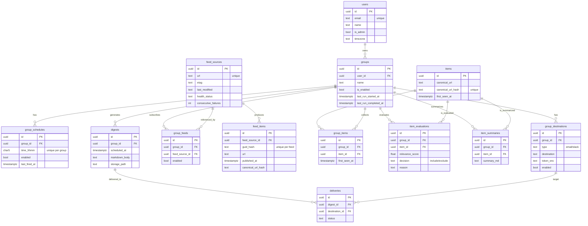

# RSSグループ別・定時収集 → LLM判定/要約 → 新聞Markdown配信（Docker完結）全体詳細設計書

作成日: 2026-01-18（JST）  
対象: Docker（ローカル/自前サーバ）内で完結するMVP設計（クラウド前提なし）

---

## 0. 要件（太字で明文化）

### 0.1 機能要件
- **ユーザーは複数の「グループ（RSS集合）」を持てる**
  - グループ = RSSフィードの集合（購読リスト）
  - グループ単位で名前/説明/有効無効を管理できる
- **グループごとに「複数の実行時刻」を設定できる**
  - 例: 07:00 / 12:30 / 20:00
  - **各時刻になると「収集を開始」し、判定・要約・新聞生成・配信まで実行する**
- **グループごとに「複数の配信先」を設定できる**
  - Email / Slack（MVPはEmailのみでも可、設計は両対応）
- **グループの更新・削除ができる**
  - RSSリスト（追加/削除/ON-OFF）ができる
- **RSS追加方法**
  - **ユーザーがURLを渡してRSSを追加できる**
  - サイトURLからRSS候補を発見して提案できる（HTMLのlink rel=alternate等）
- **取得したRSS記事は重複しない**
  - **複数RSSで同じ記事を取得しても、新聞には重複表示しない**
- **RSSフィードごとに「一度取得した記事」は二度取得・二度処理しない**
  - **同一フィード内で同じ記事を再保存しない**
  - **同一グループ内で同じ記事を再判定・再要約しない**
- **要約/判定対象は「最後に取得した日付（=前回グループ実行時刻）以降」のみ**
  - **前回実行以降に初めて見えた記事だけを判定/要約対象にする**
- **RSS取得の軽量化**
  - **ETag / Last-Modified を使って変更がなければ 304 Not Modified を受け取り、本文取得を抑制する**
- **新聞Markdownは保持し、マイページからダウンロードできる**
  - メール/Slackを消しても再DL可能
- **管理者アカウント**
  - **ユーザー一覧、利用状況、RSS利用状況、ジョブ/配信状況を閲覧できる**
  - チーム機能は不要（MVPでは単一ユーザー単位）

### 0.2 非機能要件
- **Docker内で完結**（DB/キュー/スケジューラ/ストレージを含む）
- 取りこぼしに強い（published_at欠損や並び順不定なRSSでも破綻しにくい）
- スケジュール二重実行を防ぐ
- LLMコストが暴走しない（判定/要約対象の厳格絞り込み）
- 監視/運用可能（ジョブログ、配信ログ、フィードのエラーヘルス）

---

## 1. 前提と設計方針

### 1.1 「RSSを前回以降だけ“返してもらう”」は標準では不可
RSS/Atomは基本的にクエリ（since）を受け付けないため、**HTTPリクエスト自体は定期的に行う**。  
代わりに以下で「無駄な取得/処理」を抑える。

- **ETag / Last-Modified による 304 取得**で本文ダウンロードを回避
- **DBの一意制約**で「既取得記事」はINSERTされず、後続処理対象にもならない
- **グループの前回実行時刻（since）**で判定/要約対象を厳密に限定

### 1.2 “最後に取得した日付”の定義
- **group.last_run_started_at** を「前回取得開始時刻」として採用  
  - published_at は欠損/不正があり得るため、**first_seen_at（DBに初めて入った時刻）** を主基準にする。

---

## 2. 技術スタック（Docker完結）

- Backend: Python 3.12 / FastAPI
- DB: PostgreSQL 16
- Queue & Scheduler: Redis + Celery + Celery Beat（毎分tick）
- RSS: feedparser
- HTTP client: httpx
- HTMLパース（RSS発見）: selectolax（または BeautifulSoup）
- Frontend: Next.js（App Router） + TypeScript
- ストレージ: Docker volume（/var/app_data）にMarkdownファイル保存
- LLM: OpenAI等の外部API or Ollama（任意のdocker profile）

---

## 3. システム構成

### 3.1 コンテナ構成（docker-compose）
- api: FastAPI（REST API、認証、管理画面用API）
- worker: Celery worker（RSS取得・判定・要約・新聞生成・配信）
- beat: Celery beat（毎分tickでスケジュール判定してenqueue）
- db: Postgres
- redis: Redis
- web: Next.js（画面）
- ollama: 任意（ローカルLLM）

### 3.2 全体フロー（概略）
1. Beatが毎分tickし、該当時刻のグループを発火
2. グループの有効なフィードを取得（ETag/Last-Modifiedで軽量）
3. 既取得記事はDB制約で弾く（再処理しない）
4. フィード跨ぎの重複は canonical_url で統合
5. 前回実行以降に見えた記事だけを LLM判定→includeのみ要約
6. 新聞Markdown生成→保存→配信
7. UIで閲覧/再DL

---

## 4. データモデル（ER図）



---

## 5. DBスキーマ（主要テーブルと制約）

> ここでは「仕様上の重要点」と「一意制約」を中心に列挙する（実装ではAlembicで作成）。

### 5.1 重要な一意制約（要件担保）
- **同一フィードで一度取得した記事を再取得しない**  
  `feed_items`: **UNIQUE(feed_source_id, guid_hash)**

- **複数フィードで同一記事が来ても統合（重複排除）**  
  `items`: **UNIQUE(canonical_url_hash)**

- **同一グループに同一記事を二度入れない（新聞重複排除）**  
  `group_items`: **UNIQUE(group_id, item_id)**

- **同一グループの同一記事を二度判定/要約しない**  
  `item_evaluations`: **UNIQUE(group_id, item_id)**  
  `item_summaries`: **UNIQUE(group_id, item_id)**

### 5.2 groups（前回実行時刻）
- last_run_started_at: **判定/要約対象のsince基準**
- last_run_completed_at: 監視用（成功したか）

初回実行は `scheduled_at - LOOKBACK_HOURS_DEFAULT` をsinceとする。

---

## 6. Dedup仕様（URL正規化）

### 6.1 normalize_url（MVP）
1) fragment `#...` を除去  
2) queryの追跡パラメータ削除（`utm_*`, `ref`, `fbclid`, `gclid`）  
3) host小文字化  
4) path末尾スラッシュを統一（`/`以外は末尾`/`削除）  
5) `canonical_url_hash = sha256(canonical_url)`

### 6.2 Dedupの範囲
- **同一URL（正規化後）が同一記事**として扱われる  
- canonicalタグや本文類似度まではMVP外（後で拡張可能）

---

## 7. RSS取得仕様（ETag/Last-Modified）

### 7.1 保存項目（feed_sources）
- etag
- last_modified
- last_fetch_at
- consecutive_failures / health_status

### 7.2 リクエスト
- If-None-Match: etag（存在すれば）
- If-Modified-Since: last_modified（存在すれば）

### 7.3 レスポンス処理
- 304 Not Modified: 更新なし → last_fetch_at更新（任意）
- 200 OK: feedparserで解析し、ヘッダのETag/Last-Modifiedを保存
- 失敗: consecutive_failures++、閾値で health_status を degraded/dead へ

---

## 8. “前回以降のみ判定/要約”仕様（厳密化）

### 8.1 since（唯一の基準）
- since = groups.last_run_started_at（前回の取得開始時刻）
- 初回のみ since = scheduled_at - LOOKBACK（例24h）

### 8.2 対象集合
**判定/要約対象は次の両方を満たす group_items のみ**
- group_items.first_seen_at >= since
- まだ item_evaluations が存在しない（未評価）

> published_at は参考にできるが、欠損/誤りがあるため主基準は first_seen_at。

---

## 9. ジョブ設計（Celery）

### 9.1 Beat: tick_due_schedules（毎分）
- enabledな group_schedules を取得
- user.timezone を考慮して「今の分と一致する time_hhmm」を抽出
- **last_fired_at により同一分の二重発火を防止**
- run_group_pipeline(group_id, scheduled_at=now_floor_minute) をenqueue

### 9.2 Pipeline: run_group_pipeline（グループ単位）
1) 事前チェック（group enabled / feeds enabled / schedules enabled）
2) since決定（last_run_started_at or 初回lookback）
3) fetch_group_feeds（ETag/Last-Modified）
4) materialize_items（feed_items新規分だけ items/group_items反映）
5) evaluate_and_summarize（since以降のみ）
6) compose_digest（since以降 includeのみで新聞生成）
7) deliver_digest（配信先へ送信）
8) 成功時に groups.last_run_started_at / completed_at 更新

### 9.3 タスク入出力（最小）
- fetch_group_feeds → 新規feed_itemsのID or canonical_url_hash集合
- materialize_items → 新規group_items集合
- evaluate_and_summarize → include記事集合
- compose_digest → digest_id
- deliver_digest → deliveriesログ

---

## 10. API設計（FastAPI）

### 10.1 認証
- POST /auth/login（email/password）
- POST /auth/logout
- GET /me

（Google OAuthは追加可能だがMVP必須ではない）

### 10.2 グループ
- GET /groups
- POST /groups {name, description?}
- GET /groups/{groupId}
- PATCH /groups/{groupId} {name?, description?, is_enabled?}
- DELETE /groups/{groupId}

### 10.3 RSS管理（グループ内）
- GET /groups/{groupId}/feeds
- POST /groups/{groupId}/feeds:add_by_feed_url {feed_url}
  - feed_sources upsert + group_feeds upsert
- POST /groups/{groupId}/feeds:discover_by_site_url {site_url}
  - HTMLからRSS候補を返す（candidates）
- PATCH /groups/{groupId}/feeds/{groupFeedId} {enabled}
- DELETE /groups/{groupId}/feeds/{groupFeedId}

### 10.4 スケジュール
- GET /groups/{groupId}/schedules
- POST /groups/{groupId}/schedules {time_hhmm}
- PATCH /groups/{groupId}/schedules/{id} {time_hhmm?, enabled?}
- DELETE /groups/{groupId}/schedules/{id}

### 10.5 配信先
- GET /groups/{groupId}/destinations
- POST /groups/{groupId}/destinations {type, destination, token?}
- PATCH /groups/{groupId}/destinations/{id} {enabled?}
- DELETE /groups/{groupId}/destinations/{id}

### 10.6 記事/新聞
- GET /groups/{groupId}/items?decision=all|include|exclude&from=&to=
- GET /groups/{groupId}/digests
- GET /digests/{digestId}
- GET /digests/{digestId}/download

### 10.7 管理者（is_admin）
- GET /admin/users
- GET /admin/feeds
- GET /admin/jobs
- GET /admin/deliveries

---

## 11. フロントエンド（Next.js）画面設計

### 11.1 画面一覧
- /groups：グループ一覧（作成/削除）
- /groups/[id]：ハブ（Feeds/Schedules/Destinations/Items/Digests）
- /groups/[id]/feeds：RSS管理（追加/発見/ONOFF/削除）
- /groups/[id]/schedules：時刻管理（複数追加/削除/有効無効）
- /groups/[id]/destinations：配信先管理（Email/Slack）
- /groups/[id]/items：dedup済み記事一覧（include/exclude切替、要約表示）
- /groups/[id]/digests：新聞アーカイブ
- /digests/[digestId]：新聞表示 + Markdownダウンロード

### 11.2 UI要点
- “Discover & Add”（サイトURL→RSS候補→最有力を追加）をMVPで用意
- Schedulesは時刻のバリデーション（HH:MM）
- Itemsは decision フィルタ＋要約の展開表示
- Digestsは一覧→詳細→DL

---

## 12. 新聞Markdownフォーマット（テンプレ）

```markdown
# {{group_name}} / {{YYYY-MM-DD HH:mm}}

## 今日のまとめ（3行）
- ...
- ...
- ...

## カテゴリ: {{category}}
### {{title}}
- 要約: {{summary_1_3_lines}}
- ポイント:
  - {{kp1}}
  - {{kp2}}
  - {{kp3}}
- なぜ重要か: {{why}}
- URL: {{canonical_url}}

---
Generated by RSS Digest
```

- 生成対象は **since以降の include のみ**
- 上限件数（例: 30）を設定可能

---

## 13. 運用・監視（MVP）

### 13.1 管理者が見るべき指標
- アクティブユーザー数（直近N日でdigest生成/配信成功）
- フィード取得失敗率（consecutive_failures上位）
- 304率（更新なしの割合）
- LLM呼び出し件数（判定/要約数）
- 配信失敗率（destination別）

### 13.2 ログ/テーブル
- job_runs: ジョブ種別、group、成功/失敗、エラー
- deliveries: 配信成功/失敗、エラー内容
- feed_sources: ヘルス、連続失敗、最終取得

---

## 14. セキュリティ（最低限）

- RSS本文に含まれる命令文は無視する（プロンプト注入対策）
- Slack token 等は token_enc として暗号化保存（KMSはDocker外なのでアプリ鍵で暗号化）
- 管理者APIは is_admin のみ許可
- 外部リンクを勝手にクロールしない（MVPはfeedのsnippet中心）

---

## 15. ディレクトリ設計（例）

```text
app/
  main.py
  config.py
  db.py
  models/
  schemas/
  routers/
  services/
    rss_fetcher.py
    rss_discovery.py
    dedup.py
    llm_client.py
    relevance.py
    summarizer.py
    digest_builder.py
    delivery_email.py
    delivery_slack.py
    storage.py
  tasks/
    tick.py
    fetch.py
    materialize.py
    evaluate.py
    compose.py
    deliver.py
  worker.py
web/
  app/ (Next.js App Router)
  app/lib/api.ts
  app/groups/...
alembic/
docker-compose.yml
```

---

## 16. 実装順（最短で動く）
1) DBモデル & Alembic初期マイグレーション（制約を先に入れる）
2) Group/Feed/Schedule/Destination CRUD API
3) RSS取得（ETag/Last-Modified） + feed_items upsert
4) items/group_items materialize（canonical_url dedup）
5) tick_due_schedules → run_group_pipeline
6) LLM判定/要約（since以降のみ）
7) digest生成・保存・DL
8) 配信（Mailhog→SMTP / Slack）
9) 管理者画面（一覧系）

---

## 17. 受け入れ基準（抜粋）
- 同一フィードで同じ記事が2回DBに入らない（feed_itemsのUNIQUEが効く）
- 2つのRSSから同じURLの記事が来ても items は1件、group_itemsは1件
- 前回実行より前に見えていた記事は、次回実行で判定/要約されない
- フィードが更新なしの場合、304が返り本文取得しない
- 指定時刻にパイプラインが1回だけ走る（last_fired_atで二重防止）
- 新聞Markdownが保存され、UIからDLできる
